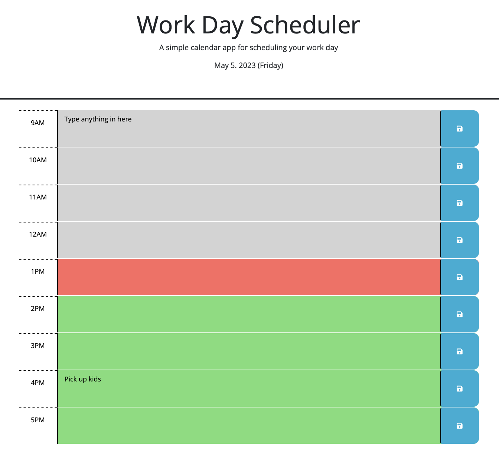

# Work Day Scheduler

This Application allows user to enter event, save the event. The saved data persists even after the page is refreshed.

## Usage
Clicking the save button (on the right of each row) will save the event typed in the corresponding row.

## Display
Left column shows the time slot from 9am to 5pm. Based on current time, each time slot is color coded.

* Past - gray
* Now - Pink
* Future - Green

